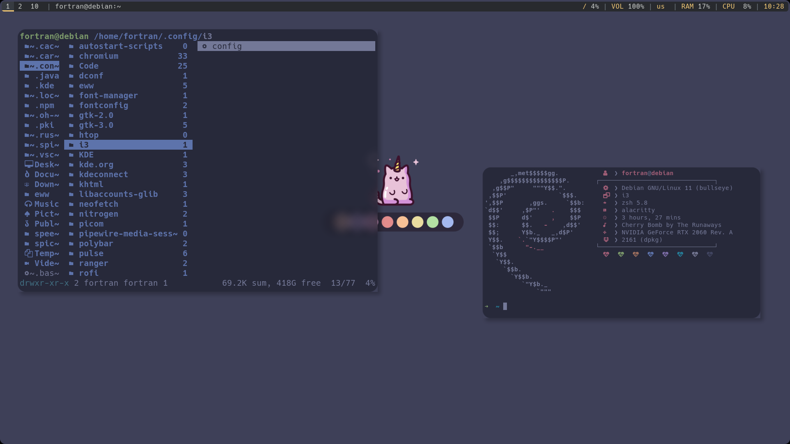

 <h2 align="left">🍙 My Linux Setup </h2> 
       
 

- 💻 **Window Manager:** [i3wm](https://github.com/i3/i3/) 
- 🦧 **Terminal:** [alacritty](https://github.com/alacritty/alacritty)
- ✨ **Shell:** [zsh](https://www.zsh.org/)
- 🔭 **Bar:** [polybar](https://github.com/polybar/polybar)
- ☕ **Compositor:** [picom](https://github.com/yshui/picom)
- 🌊 **Browser:** [chromium](https://github.com/chromium/chromium)
- 📂 **File Manager:** [ranger](https://github.com/ranger/ranger)
- 🚀 **Application Launcher:** [rofi](https://github.com/davatorium/rofi)
- 🧻  **Wallpapers** [wallpapers](https://github.com/catppuccin/wallpapers)

